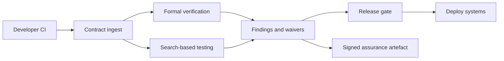

# Vericlause

**Source:** `ai-in-decentralized+ai/research-paper_1802.04451/`
**Domain:** `ai-decentralized`
**One-liner:** An ai-assisted smart-contract assurance desk that formalises, search-tests, and gates deployment so irreversible on-chain bugs are caught before mainnet value is at risk.
**Wedge:** Protocol teams and enterprise blockchain centres of excellence that ship Solidity/VM contracts holding real value and cannot rely on expensive human audits alone for every change.
**Positioning:** Marwala & Xing argue blockchain is not “uncontrolled” — humans still write flawed contracts (DAO ~$50M, Parity ~$180M). Rollbacks are hard on-chain, so ai-assisted formal verification and search-based testing are the pragmatic path to Blockchain 2.0 assurance. Vericlause productises that assurance pipeline as a release gate, not a research survey.

## Market research synthesis

### Thesis from source

The paper rejects the myth that decentralisation implies nobody controls the system: core developers and contract authors still introduce loopholes. Smart contracts are code+state (akin to classes with variables, functions, modifiers, events) used for ownership, existence, and integrity proofs via hashes — yet security standards are immature. High-profile 2016–2017 losses illustrate the cost of post-deploy failure. Blockchain 2.0 (smart contracts, smart assets, DAOs) needs dependable software. The authors map AI onto two testing pillars: **formal verification** (learn specs from traces, select proof heuristics, automate troubleshooting/root-cause) and **search-based software engineering / SBST** (search large test spaces; testing already consumes ~half of software project funding). Broader AI×blockchain synergies (sustainability, scalability, security IDS/IPS, privacy, efficiency/NUM, hardware, talent agents, data gatekeeping) motivate a united approach, but the sharpest commercial wedge in the document is **pre-deploy ai-assisted contract testing** where human audits are scarce and expensive and on-chain compensation is weak.

### Buyer & economic model

- **Primary buyer:** Head of Blockchain Engineering or Smart Contract Security lead at a protocol, exchange, or enterprise CoE.
- **Users:** contract developers, security reviewers, release managers, auditors, risk/compliance.
- **Budget owner / value metric:** security and release budget. Value metric is critical findings caught pre-deploy and mean time from PR to assurance decision.
- **Competing status quo:** manual audit firms (slow, costly), ad-hoc unit tests, post-mortem war rooms after exploits.

### Domain constraints

- **Regulatory / trust / safety:** financial loss, consumer fund custody, DAO governance legitimacy, disclosure duties after incidents.
- **Data sensitivity:** contract source and ABI may be confidential pre-launch; findings are highly sensitive.
- **Change-management realities:** developers resist gates that block shipping; Vericlause must attach to CI with severity-based waivers and dual-control for high-value deploys.

## Business requirements

- BR-1: Every mainnet candidate build must receive an assurance report covering formal checks and search-based tests before release approval.
- BR-2: Critical-severity findings must block deploy by default; waivers require dual-control and expiry.
- BR-3: The system must attempt to infer or attach specifications (invariants, access control, value-flow) rather than rely only on empty-box fuzzing.
- BR-4: Historical incidents (reentrancy, unchecked calls, custody bugs) must be encoded as regression suites applied to new code.
- BR-5: Reports must be explainable to human auditors — failing property, trace, and suggested root cause — not a single opaque score.
- BR-6: Assurance artefacts must be immutable for a release version for post-incident review.
- BR-7: Private mode must keep source within the customer boundary while still producing signed reports.
- BR-8: CI integration must complete within a published SLA for typical contract sizes or else fail open/closed per policy.
- BR-9: Risk dashboards must show open criticals across the contract portfolio, not only the latest PR.
- BR-10: Third-party auditor export packs must be one-click for external review handoff.
- BR-11: Post-deploy monitoring hooks may ingest runtime traces to refine specs, but cannot silently auto-upgrade mainnet code.
- BR-12: Pricing/value reporting must compare assurance cost vs potential loss bands informed by historical exploit magnitudes cited in policy templates.

## User stories

Canonical user stories live in sibling [USER_STORIES.md](USER_STORIES.md).

## System design

### Overview

Vericlause ingests contract source/ABI and optional specs, runs formal and search-based analyses, classifies findings, and gates releases. Waivers and dual-control manage exceptions. Artefacts attach to versions; portfolio views track residual risk. Optional runtime trace learning improves specs without auto-deploying.

### Actors & boundaries

- **Actors:** developer, security lead, release manager, auditor, operator.
- **Trust boundary:** customer source stays in private tenants; Vericlause produces reports and gates. It does not hold custody keys.
- **Human-in-the-loop points:** severity triage; waivers; mainnet approval; auditor review.

### Core capabilities

1. **Contract inventory & versions** — portfolio of deploy candidates.
2. **Specification assist** — invariants and access policies.
3. **Formal verification jobs** — property checking.
4. **Search-based test generation** — SBST campaigns.
5. **Finding management & waivers** — severity, dual-control.
6. **Release gating** — block/allow deploy.
7. **Assurance artefacts** — signed immutable reports.
8. **Auditor export & portfolio risk** — handoff and heatmaps.

### Conceptual data

- **Primary entities:** ContractProject, ContractVersion, Specification, AnalysisJob, Finding, Waiver, ReleaseGate, AssuranceArtefact.
- **Critical events:** analysis started/finished, finding opened, waiver granted/expired, gate passed/blocked, artefact signed.
- **Retention / audit needs:** artefacts and waivers retained for the incident and regulatory window.

### Integrations (conceptual)

- **Systems of record:** git/CI, artefact registries, deploy key managers, ticketing.
- **Upstream signals:** runtime traces (optional), known-vulnerability corpora.
- **Downstream actions:** deploy blockers, Slack/pager alerts, auditor data rooms.

### High-level architecture

### Success metrics

- **Leading:** % mainnet deploys with passing gate; median time-to-first-finding on PR; critical reopen rate.
- **Lagging:** post-deploy critical incidents; audit cycle time reduction; waiver debt age.

## OpenAPI skeleton

Canonical HTTP surface lives in sibling `openapi.yaml`. Summarize here:

- **Base path:** `/v1/...`
- **Auth:** API key and/or Bearer JWT (operator)
- **Resource groups:** ContractProjects, AnalysisJobs, Findings, Waivers, ReleaseGates, AssuranceArtefacts
