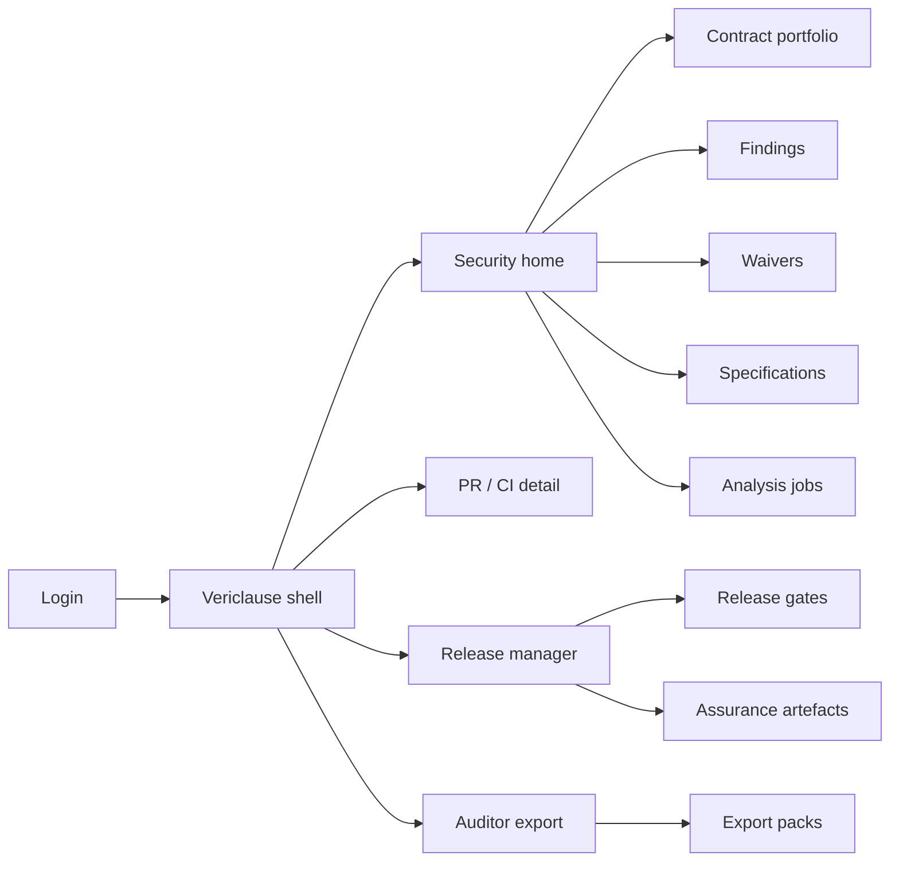
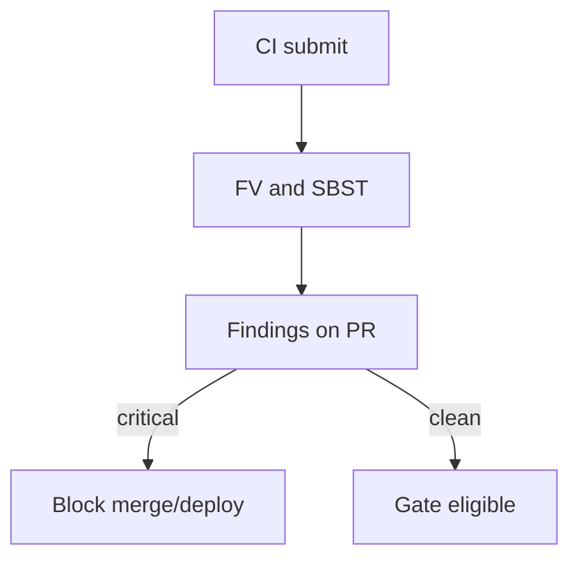
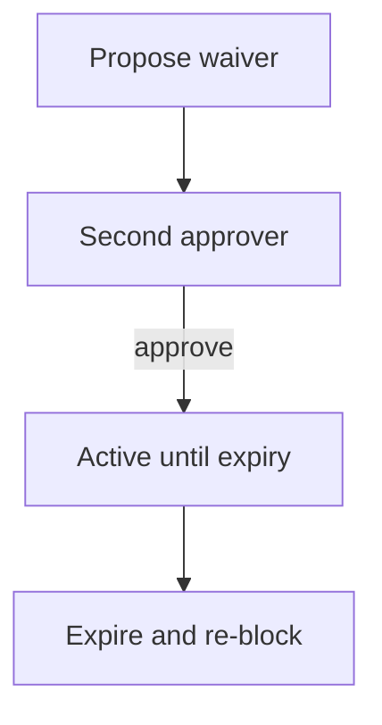

# Vericlause — Web app

**Product:** [PRODUCT.md](./PRODUCT.md)
**Primary surface:** Smart-contract assurance console for protocol security and release managers
**Secondary surfaces:** CI status badge / PR check detail (read-mostly); auditor data-room export viewer
**Design thesis:** Vericlause is a courtroom for irreversible code — formal properties and search-based trials must pass before mainnet keys turn. The metaphor is a clause ledger and release gavel, not a generic “security score” SaaS. Visual language is deep ink with verdict-green and injunction-red on cool stone panels: blocked deploys feel final; waived criticals feel provisional with expiry clocks; signed artefacts feel notarised. The wordmark sits as a quiet notary mark on every gate-bearing screen so release managers know whose assurance they are citing when value is irreversible.

## UX research synthesis

### Category peers (best-in-class)

- **Trail of Bits / Diligence-style audit workspaces:** Finding severity, traces, and handoff packs for external auditors. Steal: explainable finding → property → trace; reject opaque letter-grade scores as the only output.
- **Certora Prover / formal verification UIs:** Spec-centric property checking before deploy. Steal: invariants and access-control specs as first-class objects; reject requiring PhD-only CLI as the sole path for CoE teams.
- **GitHub Advanced Security / PR check UX:** CI-native gates with blocking checks and waiver patterns. Steal: severity-based block on mainnet candidates; dual-control waivers with expiry — not permanent mute.
- **MythX / Slither dashboard patterns:** Job queues for analysis on contract versions. Steal: portfolio heatmap of open criticals across contracts; reject fuzz-only without formal/spec assist.

### Patterns to adopt / reject

- **Adopt:** Assurance report required before release approval; criticals block by default; dual-control waivers with expiry; inferred/attached specs (invariants, access, value-flow); historical exploit regression suites; explainable traces; immutable signed artefacts per version; private-mode source boundary; portfolio risk heatmap; auditor one-click packs.
- **Reject:** Single opaque “AI secure” score; silent auto-upgrade of mainnet; editable past artefacts; fail-open without policy; purple AI glow; chatbot as the primary verifier.

### Trust, density, and workflow constraints from PRODUCT.md

Every mainnet candidate needs formal + SBST coverage before approval (BR-1). Criticals block; waivers dual-control + expiry (BR-2). Specs over empty-box fuzz alone (BR-3). Historical incident suites (BR-4). Explainable to humans (BR-5). Artefacts immutable per version (BR-6). Private mode keeps source in customer boundary (BR-7). CI SLA with fail open/closed per policy (BR-8). Portfolio criticals, not only latest PR (BR-9). Auditor export (BR-10). Runtime traces may refine specs but never auto-deploy (BR-11). Value reporting vs historical loss bands (BR-12).

## Information architecture

### Nav model

### Roles → default home

| Role | Default home | Why |
|------|--------------|-----|
| Security lead | Portfolio heatmap | Open criticals across contracts (BR-9) |
| Contract developer | PR / CI detail | First finding on PR with traces |
| Release manager | Release gates | Signed artefact before go-live |
| External auditor | Export packs | Handoff from machine work (BR-10) |
| Risk / compliance | Waiver debt age | Expiring exceptions (BR-2) |

### Cross-links to OpenAPI resources

| Nav area | OpenAPI tags / resources |
|----------|---------------------------|
| Portfolio / versions | ContractProjects |
| Formal + SBST runs | AnalysisJobs |
| Defect triage | Findings |
| Dual-control exceptions | Waivers |
| Deploy blockers | ReleaseGates |
| Signed reports | AssuranceArtefacts |

## Screen inventory

### Security home — portfolio heatmap

- **Purpose:** Show residual critical risk across the contract estate, not only the latest PR.
- **Entry:** Security lead login.
- **Layout regions:** Brand notary mark; heatmap by project/version; open critical count; waiver debt age; value-at-risk band vs historical exploit templates.
- **Primary actions:** Open project; drill criticals; export portfolio snapshot.
- **Empty / loading / error:** Empty = connect first repo/project; error with request id.
- **BR / story ties:** BR-9, BR-12.

### Contract version detail

- **Purpose:** One version’s assurance state — specs, jobs, findings, gate.
- **Entry:** Portfolio drill; CI deep link.
- **Layout regions:** Version identity (commit/build); spec pane; job status (formal / SBST); finding list; gate status; artefact link.
- **Primary actions:** Re-run analysis; open finding; request waiver; sign artefact when green.
- **Empty / loading / error:** No jobs yet = run CTA; SLA breach banner per policy (BR-8).
- **BR / story ties:** BR-1, BR-8.

### Specification assist

- **Purpose:** Attach or infer invariants, access control, and value-flow properties.
- **Entry:** Version → Specs.
- **Layout regions:** Spec list; inferred candidates from traces; editor; coverage vs analysis.
- **Primary actions:** Accept inferred spec; edit; mark required for gate.
- **Empty / loading / error:** Empty = start from historical incident templates (reentrancy, unchecked calls).
- **BR / story ties:** BR-3, BR-4, BR-11.

### Analysis jobs

- **Purpose:** Run and monitor formal verification and search-based campaigns.
- **Entry:** Version jobs; CI trigger.
- **Layout regions:** Job queue; type (FV / SBST); duration vs SLA; logs summary; link to findings produced.
- **Primary actions:** Launch; cancel; pin regression suite.
- **Empty / loading / error:** Timeout = fail open/closed per project policy, never silent.
- **BR / story ties:** BR-1, BR-4, BR-8.

### Finding detail

- **Purpose:** Explain failing property, trace, and suggested root cause to humans.
- **Entry:** Findings list; PR annotation.
- **Layout regions:** Severity; property id; failing trace; root-cause suggestion; related historical incident tag; reproduce steps.
- **Primary actions:** Open waiver; mark fixed; export to ticket.
- **Empty / loading / error:** N/A per finding; missing trace = incomplete analysis warning.
- **BR / story ties:** BR-5; developer stories.

### Waiver desk

- **Purpose:** Dual-control exceptions with expiry so urgency cannot become permanent debt.
- **Entry:** Finding action; Waivers nav.
- **Layout regions:** Pending dual approvals; active waivers with countdown; expired → re-block; rationale history.
- **Primary actions:** Propose; second-approve; revoke; extend (new dual-control).
- **Empty / loading / error:** Empty = no waivers; single-approver blocked.
- **BR / story ties:** BR-2; security lead stories.

### Release gate

- **Purpose:** Block or allow deploy based on assurance; attach signed artefact.
- **Entry:** Release manager home; deploy system webhook.
- **Layout regions:** Gate verdict; blocking findings; waiver summary; sign control; private-mode attestation.
- **Primary actions:** Approve when clear; block; download artefact.
- **Empty / loading / error:** Missing artefact = cannot approve; critical open = injunction-red block.
- **BR / story ties:** BR-1, BR-6, BR-7.

### Assurance artefact viewer

- **Purpose:** Immutable signed report per release version for post-incident review.
- **Entry:** Gate; Auditor packs.
- **Layout regions:** Version hash; findings snapshot; specs hash; signature; immutability seal (no edit).
- **Primary actions:** Download; verify signature; share to auditor room.
- **Empty / loading / error:** Unsigned = not release-ready.
- **BR / story ties:** BR-6, BR-10.

### Auditor export pack

- **Purpose:** One-click handoff of specs, tests, findings, and waiver history.
- **Entry:** Auditor role; security export.
- **Layout regions:** Pack checklist; waiver history pane; download.
- **Primary actions:** Generate; verify hash.
- **Empty / loading / error:** Incomplete analysis = warn before share.
- **BR / story ties:** BR-10; auditor stories.

### Private mode settings

- **Purpose:** Keep source in customer boundary while still producing signed reports.
- **Entry:** Project settings.
- **Layout regions:** Boundary mode; what leaves tenant (report only); attestation for enterprise questionnaires.
- **Primary actions:** Enable private mode; rotate keys.
- **Empty / loading / error:** Misconfig blocks analysis start.
- **BR / story ties:** BR-7.

## Key flows

1. **PR assurance** — CI submit → FV + SBST → findings on PR → fix or waiver path; failure: SLA timeout per policy.

2. **Critical waiver** — propose → second identity → expiry clock → auto re-block on expiry (BR-2).

3. **Mainnet release** — version green → sign artefact → gate allow → deploy systems notified (BR-6).

4. **Auditor handoff** — select version → export pack with waiver history → external review (BR-10).

5. **Runtime refine (no auto-deploy)** — ingest traces → propose spec updates → human accept → never silent mainnet upgrade (BR-11).

## Design system

### Tokens (CSS variables)

- `--color-ink: #E8ECF1` — text on dark
- `--color-stone-950: #0B0E14` — app ground
- `--color-stone-900: #141821` — panels
- `--color-stone-700: #2C3340` — rules
- `--color-verdict: #3DAA78` — gate pass / signed
- `--color-injunction: #D94A4A` — critical block
- `--color-provisional: #D4A017` — waiver active
- `--color-notary: #8FA3B8` — brand steel-blue (not purple)
- `--color-mute: #8B93A0` — secondary
- `--font-display: "Newsreader", serif` — clause titles / verdicts
- `--font-body: "IBM Plex Sans", sans-serif`
- `--font-mono: "IBM Plex Mono", monospace` — traces, hashes, property ids
- `--space-1`…`--space-8`: 4px scale
- `--radius-sm: 3px`; `--radius-md: 6px`
- `--motion-gavel: 180ms ease-out` — gate verdict
- `--motion-waiver: 240ms ease-in-out` — expiry pulse
- `--motion-trace: 200ms linear` — trace reveal
- Atmosphere: quiet notary stone, thin vertical clause rules — irreversible-code courtroom; no purple AI; no neon crypto; no broadsheet density.

### Typography & brand

- Newsreader for verdicts and screen titles; mono for traces and hashes.
- Vericlause wordmark on every gate- and artefact-bearing view.
- Login: brand + “Catch irreversible bugs before mainnet” + one CTA.

### Do / don’t

- **Do:** Block criticals by default; show traces; lock signed artefacts; dual-control waivers with clocks; portfolio heatmaps.
- **Don’t:** Opaque AI scores; editable artefacts; permanent mute of criticals; purple glow; card grids of vanity “secure %.”

### Accessibility & domain trust cues

- Block/pass never colour-only.
- Live regions for gate changes and waiver expiry.
- Focus: findings → waiver → gate → artefact.
- Artefacts machine-verifiable signatures for auditors.

## Component patterns

- **PortfolioHeatcell** — residual critical density by contract version.
- **PropertyTracePanel** — failing property + reproduce trace.
- **WaiverExpiryChip** — dual-control provisional state.
- **ReleaseGateBanner** — injunction/verdict for deploy.
- **AssuranceSeal** — immutable signed artefact header.
- **SpecInferCard** — candidate invariant with accept/edit (interaction container).
- **HistoricalSuiteTag** — DAO/Parity-class regression linkage.
- **AuditorPackExport** — one-click handoff.

## Out of scope for v1 web

- Holding deploy keys or custody; full IDE; on-chain monitoring as primary product; replacing human audit firms; consumer wallet; L1 client development; automatic mainnet upgrades.
